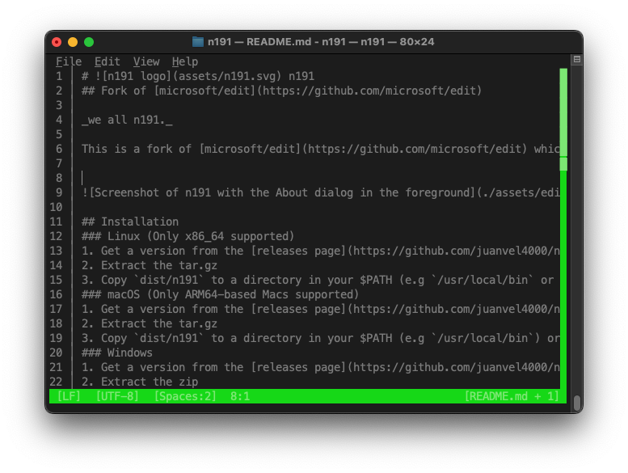

#  n191
## Fork of [microsoft/edit](https://github.com/microsoft/edit)

_We all n191._

This is a fork of [microsoft/edit](https://github.com/microsoft/edit) which itself pays homage to [MS-DOS Editor](https://en.wikipedia.org/wiki/MS-DOS_Editor). n191 was made to fix some issues with edit and port it to **macOS**



## Why?
[microsoft/edit](https://github.com/microsoft/edit) builds use `.cargo/release-windows-ms.toml` which points to a private cargo index in azure probably contains telemetry or propertary code, n191 provides binaries built with `.cargo/release.toml`

Not to mention [microsoft/edit](https://github.com/microsoft/edit) does not provide macOS Binaries, we provide binaries for macOS (ARM-based Macs) and a homebrew tap (for ARM or Intel based Macs)

## Installation
### Linux (Only x86_64 supported)
1. Get a version from the [releases page](https://github.com/juanvel4000/n191/releases)
2. Extract the tar.gz
3. Copy `dist/n191` to a directory in your $PATH (e.g `/usr/local/bin` or `~/.local/bin`)
### macOS (Only ARM64-based Macs supported)
1. Get a version from the [releases page](https://github.com/juanvel4000/n191/releases)
2. Extract the tar.gz
3. Copy `dist/n191` to a directory in your $PATH (e.g `/usr/local/bin`) or create a new one and append `export PATH=$PATH:(your directory)` to your shell initialization file (usually `.zshrc`)
### Windows
1. Get a version from the [releases page](https://github.com/juanvel4000/n191/releases)
2. Extract the zip
3. Copy `dist\n191.exe` to any directory, for example `%LOCALAPPDATA%\Programs\n191`
4. Add this directory to your path globally, run this in a powershell session
```pwsh
$target = "$env:LOCALAPPDATA\Programs\n191"
New-Item -ItemType Directory -Force -Path $target
[Environment]::SetEnvironmentVariable("Path", $env:Path + ";$target", "User")
```
**Note**: change `n191` for the directory you stored `n191.exe` in


### Brew
This works on any Mac
1. Add the tap
`brew tap juanvel4000/homebrew-n191`
2. Install n191
`brew install n191`
## Build Instructions
You need Rust `1.87` or newer 
* [Install Rust](https://www.rust-lang.org/tools/install)
* Install the nightly toolchain: `rustup install nightly`
  * Alternatively, set the environment variable `RUSTC_BOOTSTRAP=1`
* Clone the repository
* For a release build, run: `cargo build --config .cargo/release.toml --release`

## Credits
- **Microsoft** for edit
## License
n191 is licensed with the MIT License, read LICENSE
